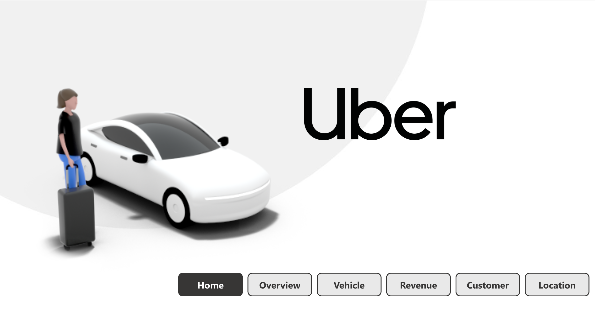
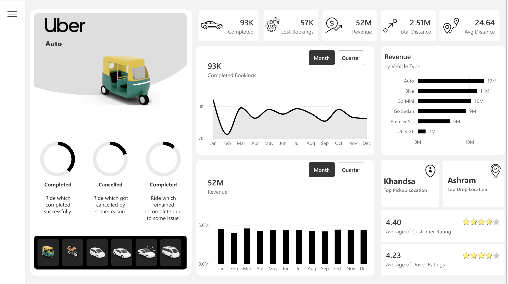
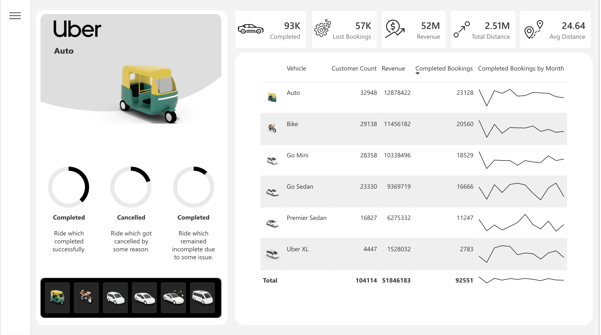
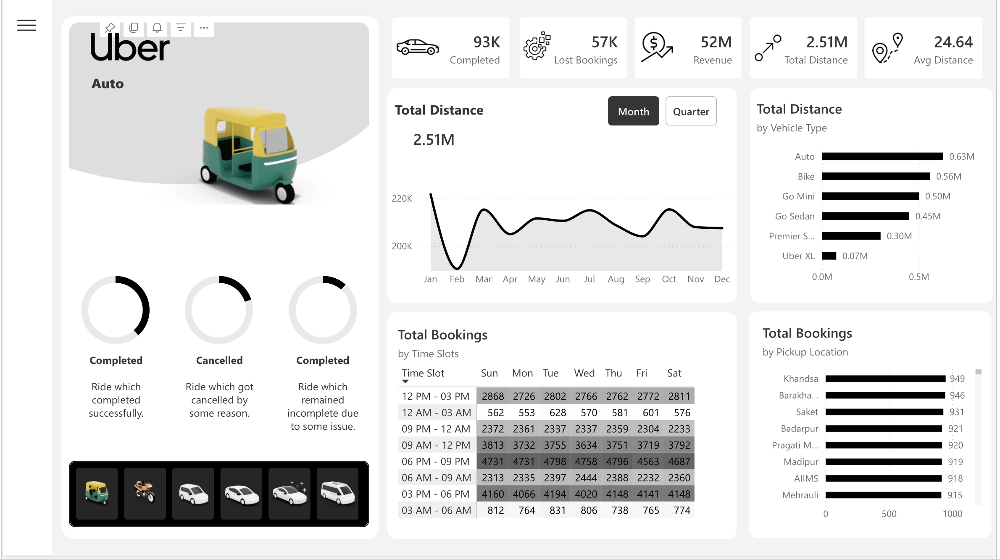
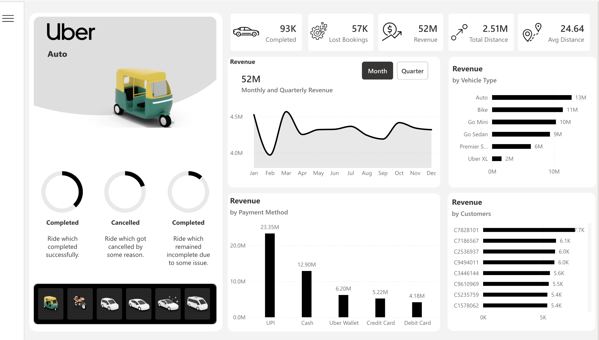
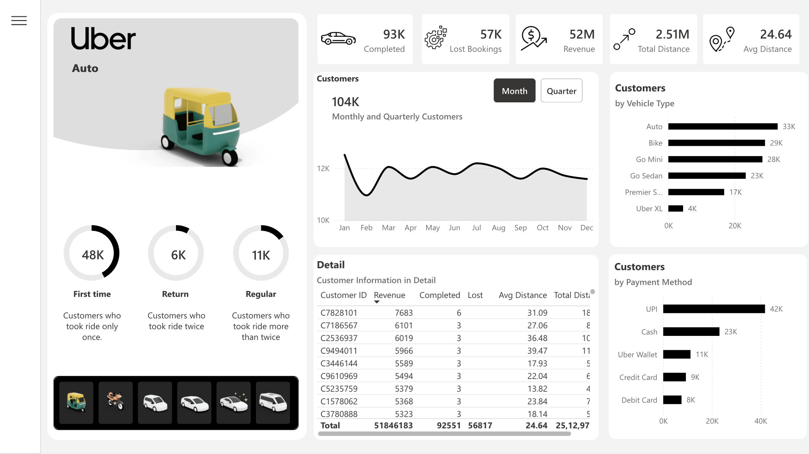

# 🚖 Uber Ride Analytics | MySQL + Python + Power BI Portfolio Project

A complete end-to-end Data Analytics project built using **Python, MySQL, SQL, and Power BI** to analyze Uber ride booking operations, customer behavior, revenue trends, cancellations, vehicle performance, and location-based insights.

This project simulates a real-world analytics workflow where raw ride booking data is automatically loaded into a MySQL database, transformed into analytical tables, queried using advanced SQL, and visualized through an interactive Power BI dashboard.

---

## 🎯 Project Objectives

The goal of this project is to analyze Uber ride operations and answer critical business questions related to:

✅ Revenue Performance

✅ Booking Trends

✅ Vehicle Utilization

✅ Customer Behavior

✅ Ride Completion Rates

✅ Cancellation Analysis

✅ Driver Performance

✅ Payment Preferences

✅ Geographic Demand Patterns

✅ Customer Satisfaction Metrics

---

# 🏗️ Tech Stack

### Programming & Data Engineering

* Python
* Pandas
* SQLAlchemy
* MySQL Connector

### Database

* MySQL (Hosted on **Aiven Cloud**)

### Business Intelligence

* Power BI

### Deployment

* Vercel (Web Application)

### Version Control

* Git
* GitHub

---

# 📊 Dataset Overview

The dataset contains **150,000 Uber ride booking records** with detailed ride-level information.

### Key Attributes

| Column               | Description                            |
| -------------------- | -------------------------------------- |
| Booking ID           | Unique booking identifier              |
| Date                 | Ride booking date                      |
| Time                 | Ride booking time                      |
| Booking Status       | Ride completion/cancellation status    |
| Customer ID          | Unique customer identifier             |
| Vehicle Type         | Type of vehicle booked                 |
| Pickup Location      | Ride origin                            |
| Drop Location        | Ride destination                       |
| Booking Value        | Total booking amount                   |
| Ride Distance        | Distance travelled                     |
| Driver Ratings       | Rating provided to driver              |
| Customer Rating      | Rating provided by customer            |
| Payment Method       | Mode of payment                        |
| Cancellation Reasons | Customer & Driver cancellation details |

---

# ⚙️ Project Workflow

## 1️⃣ Automated Data Pipeline

The project begins with a Python-based ETL workflow.

### Python Pipeline Responsibilities

* Reads Uber ride dataset CSV files
* Creates MySQL database automatically
* Generates required tables
* Loads booking records into MySQL
* Executes SQL queries through connectors
* Supplies analytical data for Power BI reporting

---

## 2️⃣ Database Integration

Python connects to MySQL using:

```python
mysql-connector-python
sqlalchemy
```

The MySQL database is hosted on **Aiven Cloud**, providing a fully managed, cloud-native database environment with high availability and secure remote connectivity.

The pipeline automatically:

* Creates database
* Creates tables
* Inserts ride records
* Runs analytical SQL queries

---

## 3️⃣ Power BI Integration

Power BI is connected directly with the Aiven-hosted MySQL database to create interactive dashboards.

The dashboards provide:

* Executive Summary
* Revenue Analytics
* Vehicle Performance
* Location Intelligence
* Customer Insights

---

# 📈 Dashboard Screenshots

## 🏠 Home Dashboard



Provides navigation across all analytical pages.

---

## 📊 Overview Dashboard



Key KPIs displayed:

* Total Bookings
* Completed Rides
* Cancellation Rate
* Revenue Generated
* Average Booking Value
* Ride Completion Percentage

Insights:

* Majority of rides are completed successfully.
* Cancellation volume remains concentrated among specific ride categories.
* Booking demand remains consistent across the year.

---

## 🚗 Vehicle Analysis Dashboard



Analyzes:

* Vehicle-wise bookings
* Revenue contribution by vehicle
* Average fare by vehicle
* Ride distance comparison

Insights:

* Auto and Go Mini dominate booking volume.
* Premium categories generate higher revenue per ride.
* Vehicle utilization differs significantly across segments.

---

## 📍 Location Analysis Dashboard



Analyzes:

* Top pickup locations
* Top drop locations
* High-demand zones
* Ride movement patterns

Insights:

* Certain locations consistently generate higher booking demand.
* Business districts show strong pickup activity.
* Residential zones dominate drop locations.

---

## 💰 Revenue Dashboard



Analyzes:

* Total Revenue
* Revenue by Vehicle Type
* Revenue by Payment Method
* Monthly Revenue Trends

Insights:

* Completed rides contribute the majority of revenue.
* UPI is the most preferred payment method.
* Premium rides deliver higher average booking values.

---

## 👥 Customer Analytics Dashboard



Analyzes:

* Customer Ratings
* Repeat Customer Behavior
* Payment Preferences
* Customer Satisfaction

Insights:

* Average customer rating remains above industry benchmarks.
* Digital payment adoption is dominant.
* Customer experience remains consistently positive.

---

# 📌 Key Business Findings

### Ride Status Distribution

* Completed Rides: ~93,000
* Driver Cancellations: ~27,000
* Customer Cancellations: ~10,500
* No Driver Found: ~10,500
* Incomplete Rides: ~9,000

---

### Vehicle Demand

Most booked vehicle categories:

1. Auto
2. Go Mini
3. Go Sedan
4. Bike
5. Premier Sedan

---

### Payment Behavior

Most preferred payment methods:

* UPI
* Cash
* Uber Wallet
* Credit Card
* Debit Card

---

### Customer Satisfaction

Average Customer Rating:

**4.40 / 5**

Average Driver Rating:

**4.23 / 5**

---

# 🧠 Advanced SQL Business Problems Solved

The project includes advanced MySQL analytical queries used in real-world business environments.

---

## 1. Top Revenue Generating Vehicle Types

```sql
SELECT vehicle_type,
SUM(booking_value) AS revenue
FROM bookings
WHERE booking_status='Completed'
GROUP BY vehicle_type
ORDER BY revenue DESC;
```

---

## 2. Monthly Revenue Trend Analysis

```sql
SELECT
MONTH(date) AS month_no,
SUM(booking_value) AS revenue
FROM bookings
GROUP BY MONTH(date);
```

---

## 3. Ride Completion Rate

```sql
SELECT
ROUND(
SUM(CASE WHEN booking_status='Completed' THEN 1 END)
*100/COUNT(*),2
) completion_rate
FROM bookings;
```

---

## 4. Top Pickup Locations

```sql
SELECT pickup_location,
COUNT(*) rides
FROM bookings
GROUP BY pickup_location
ORDER BY rides DESC;
```

---

## 5. Top Drop Locations

```sql
SELECT drop_location,
COUNT(*) rides
FROM bookings
GROUP BY drop_location
ORDER BY rides DESC;
```

---

## 6. Vehicle-wise Average Fare

```sql
SELECT vehicle_type,
AVG(booking_value)
FROM bookings
GROUP BY vehicle_type;
```

---

## 7. Vehicle-wise Revenue Contribution

```sql
SELECT vehicle_type,
SUM(booking_value)
FROM bookings
GROUP BY vehicle_type;
```

---

## 8. Customer Cancellation Analysis

```sql
SELECT
reason_for_cancelling_by_customer,
COUNT(*)
FROM bookings
GROUP BY reason_for_cancelling_by_customer;
```

---

## 9. Driver Cancellation Analysis

```sql
SELECT
driver_cancellation_reason,
COUNT(*)
FROM bookings
GROUP BY driver_cancellation_reason;
```

---

## 10. Average Ride Distance by Vehicle

```sql
SELECT vehicle_type,
AVG(ride_distance)
FROM bookings
GROUP BY vehicle_type;
```

---

## 11. Top Customers by Spending

```sql
SELECT customer_id,
SUM(booking_value) total_spend
FROM bookings
GROUP BY customer_id
ORDER BY total_spend DESC;
```

---

## 12. Revenue by Payment Method

```sql
SELECT payment_method,
SUM(booking_value)
FROM bookings
GROUP BY payment_method;
```

---

## 13. Peak Booking Hours

```sql
SELECT HOUR(time),
COUNT(*)
FROM bookings
GROUP BY HOUR(time)
ORDER BY 2 DESC;
```

---

## 14. Highest Rated Drivers

```sql
SELECT
AVG(driver_ratings)
FROM bookings;
```

---

## 15. Customer Rating Distribution

```sql
SELECT
ROUND(customer_rating,1),
COUNT(*)
FROM bookings
GROUP BY ROUND(customer_rating,1);
```

---

# ⭐ Project Highlights

* End-to-End Analytics Pipeline
* Automated MySQL Data Loading via Aiven Cloud
* Advanced SQL Querying
* Business KPI Development
* Interactive Power BI Dashboards
* Real-World Ride Sharing Dataset
* Live Web Application Deployed on Vercel

---

# 🌐 Interactive Web Dashboard & AI Chatbot

As an extension of this project, an interactive web application was built to make the analytics more accessible and conversational.

## 🖥️ Web Dashboard

The Power BI dashboard insights are presented through a web interface, allowing users to explore Uber ride analytics visually without needing Power BI Desktop.

🔗 **Live Demo: [View on Vercel](https://your-project.vercel.app)**

---

## ☁️ Cloud Database — Aiven

The MySQL database is hosted on Aiven, a fully managed open-source cloud database platform. This enables:

* Secure remote connectivity from the web app, Power BI, and Python pipeline
* High availability with automated backups
* Easy scalability for large datasets
* SSL-encrypted connections for data security

---

## 🤖 Groq LLM Powered Chatbot

A conversational AI chatbot is integrated into the web app, powered by Groq LLM, that allows users to ask questions about the Uber ride data in plain English.

### How It Works

1. User asks a question in natural language

   > *"What is the total revenue generated by Auto vehicles?"*

2. Groq LLM converts it to SQL automatically

   ```sql
   SELECT SUM(booking_value) FROM bookings
   WHERE vehicle_type = 'Auto' AND booking_status = 'Completed';
   ```

3. Query is executed against the Aiven-hosted MySQL database in real time
4. Result is returned to the user along with the executed query for full transparency

### Chatbot Capabilities

* Natural language to SQL conversion
* Real-time query execution on live Aiven cloud database
* Returns both the answer and the SQL query used
* Supports questions on revenue, bookings, cancellations, ratings, locations, and more

---

## 🎥 Demo Video

A full walkthrough of the web dashboard and AI chatbot is available here:

🔗 **Direct Link: https://www.youtube.com/watch?v=your-demo-video-link**
